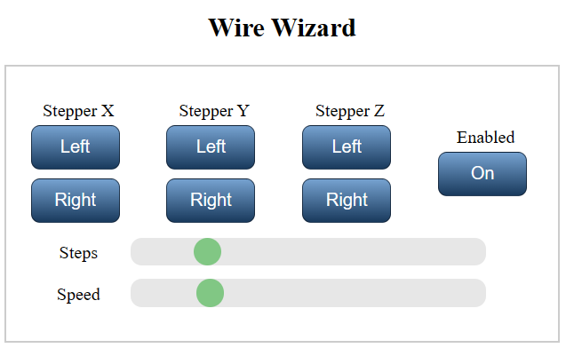
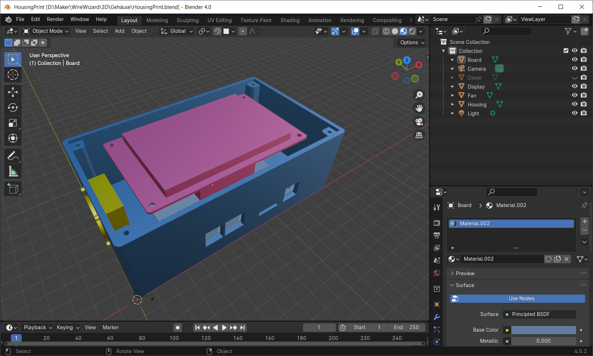
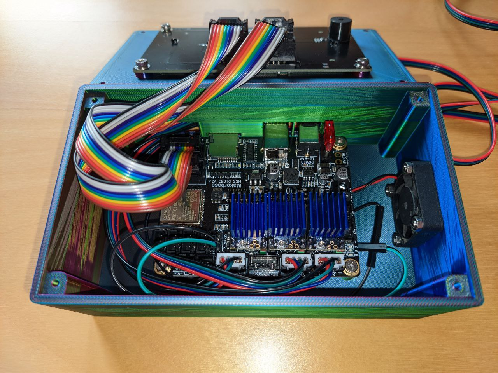
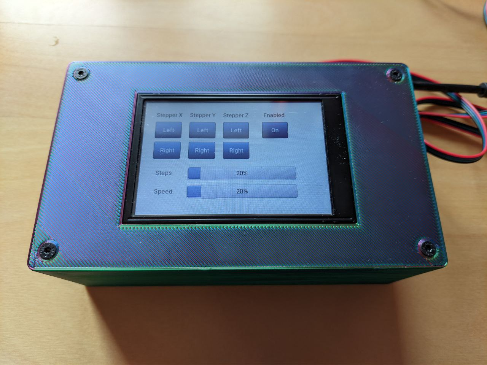

# WireWizard "Under Construction"

 

 
 
 

lvgl Library
  Version 9.0.0
  https://lvgl.io
  
TFT_eSPI Library  
  Version 2.5.43
  https://github.com/Bodmer/TFT_eSPI
  
  **Anpassungen in User_Setup.h**  
  #define ST7796_DRIVER  
  #define TFT_WIDTH  480  
  #define TFT_HEIGHT 320  
  #define TFT_MISO 19  
  #define TFT_MOSI 23  
  #define TFT_SCLK 18  
  #define TFT_CS   25  // Chip select control pin   
  #define TFT_DC   33  // Data Command control pin  
  #define TFT_RST  27  // Reset pin (could connect to RST pin)  
  #define TOUCH_CS 26     // Chip select pin (T_CS) of touch screen  
  // #define SMOOTH_FONT  
  #define SPI_FREQUENCY  40000000  
  #define SPI_TOUCH_FREQUENCY  2000000  

### Special thanks to

**betaone for the universal housing with cover on thingiverse  
https://www.thingiverse.com/thing:1701426**